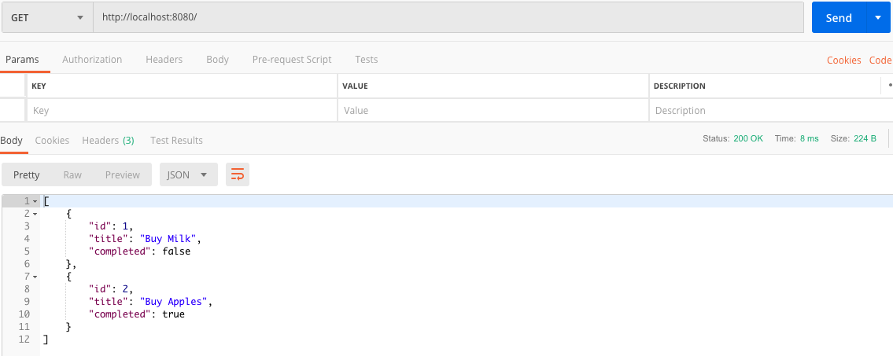
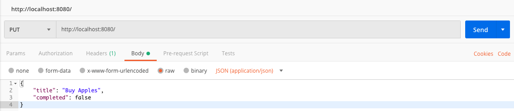
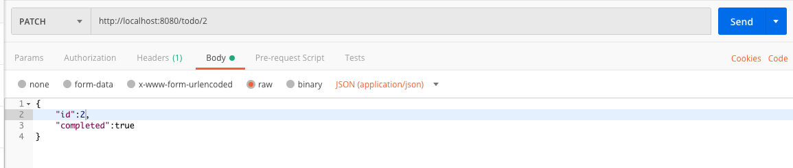
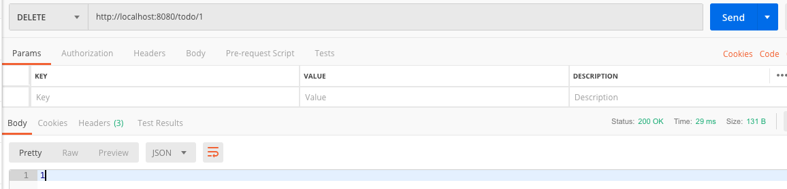
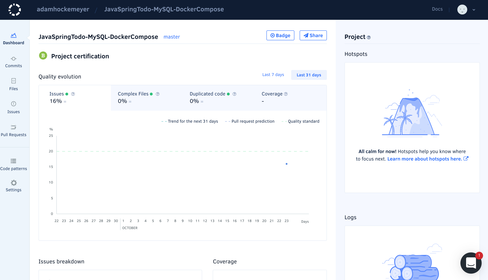
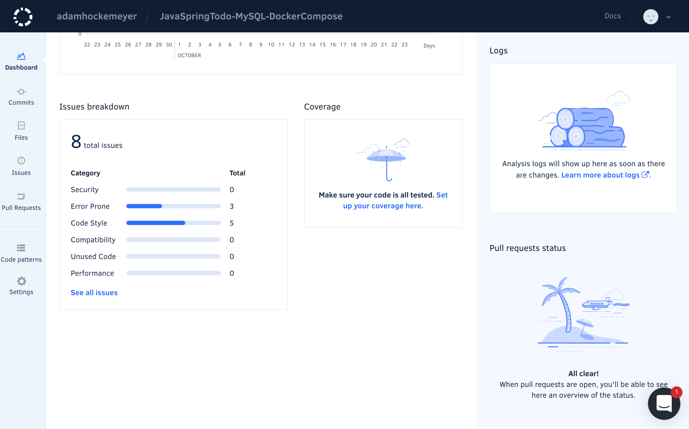
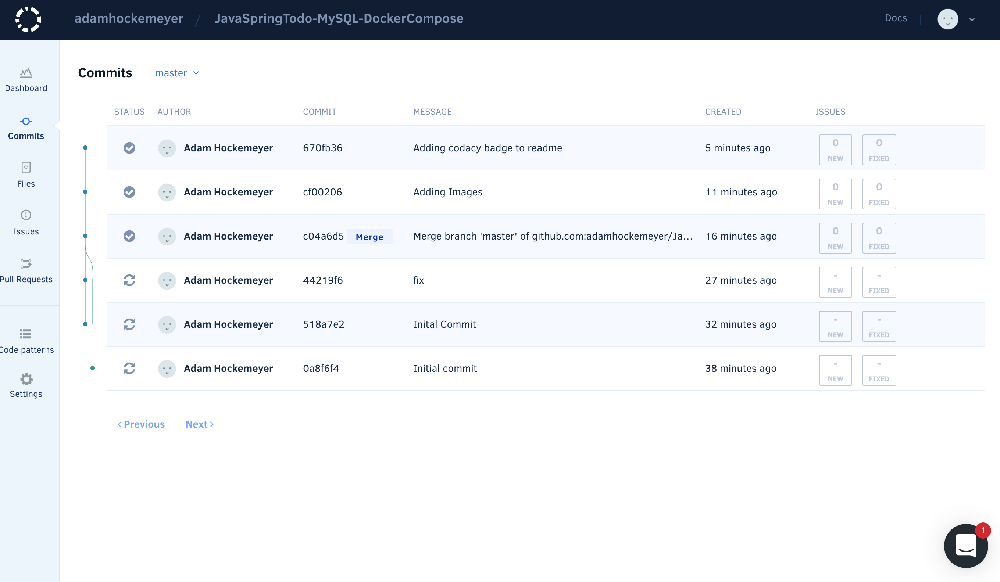
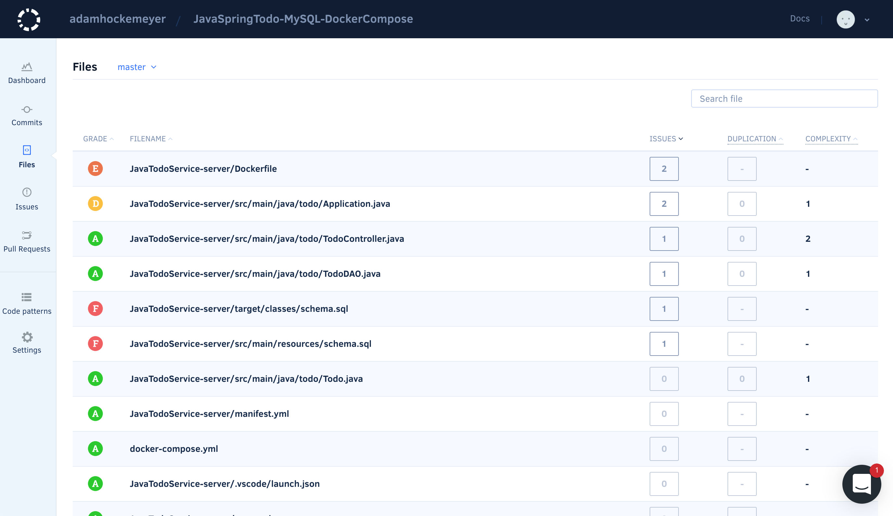
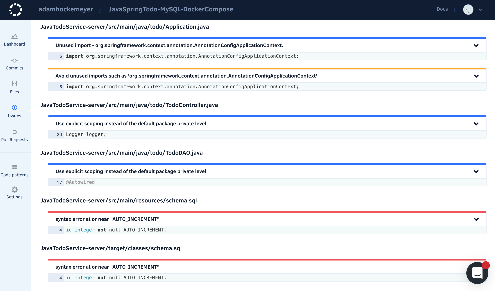

# JavaSpringTodo-MySQL-DockerCompose

Example of a Java Spring REST service with a MySQL database running as a docker container.

This sample project is a backend 'TODO' REST service built on Java Spring Framework.  The project is setup to run with docker-compose which will run the backend 'TODO' REST service and also run a MySQL database in a container to persist your 'TODO's.

[Codacy](https://www.codacy.com) was added since it is free for open source projects and provides some excellent insights into your overall code quality as well as individual problem areas that may need your attention.

## Java Spring REST API - Postman

Get:

Add:

Update:

Delete:

## Codacy Results

Dashboard:

Dashboard Issues by Category:

Commits:

Files:

Issues:

